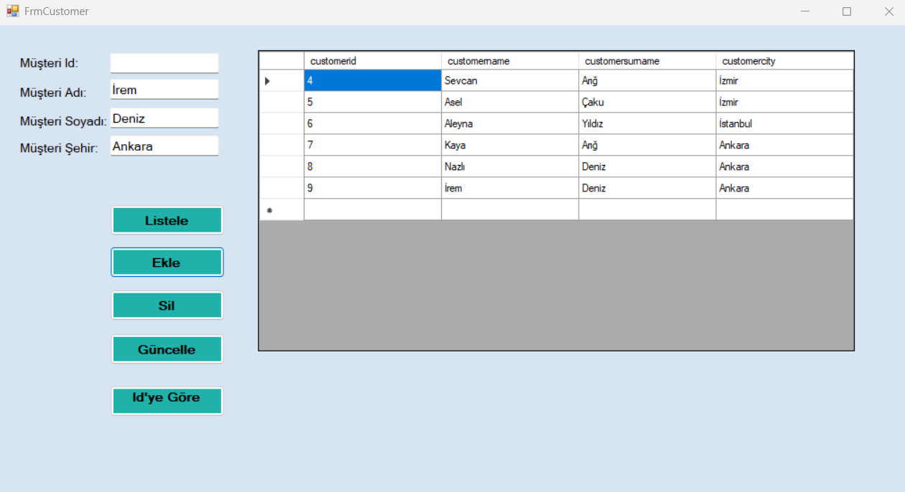

# 🚀 Müşteri Takip Sistemi (C# Windows Forms + MongoDB)

Bu proje, **C# Windows Forms** ve **MongoDB** kullanılarak geliştirilen bir müşteri yönetim uygulamasıdır. Uygulama ile müşteri kayıtları üzerinde ekleme, silme, güncelleme ve listeleme işlemleri gerçekleştirilebilmekte; aynı zamanda arama  gibi işlemlerle verilere hızlı erişim sağlanabilmektedir.

---

## 🖼️ Uygulama Görünümü

Aşağıda uygulamaya ait örnek bir ekran görüntüsü yer almaktadır:

---

## 🛠️ Kullanılan Teknolojiler

- **C#**: Uygulamanın geliştirme dili  
- **MongoDB**: NoSQL veritabanı yönetim sistemi  
- **Windows Forms**: Masaüstü kullanıcı arayüzü  
- **Visual Studio**: Geliştirme ortamı  

---

## 📊 Uygulama Özellikleri

Bu projede aşağıdaki işlevler uygulanmıştır:

- **Müşteri Listeleme**: Tüm müşterileri görüntüleme ve ID bilgisine göre filtreleme  
- **Müşteri Ekleme**: Sisteme yeni müşteri kaydı oluşturma  
- **Müşteri Silme**: Mevcut müşteri kayıtlarını silme  
- **Müşteri Güncelleme**: Var olan müşteri bilgilerini düzenleme  
- **ID'ye Göre Getirme**: Belirli bir müşteriyi ID bilgisi ile sorgulama  

---

